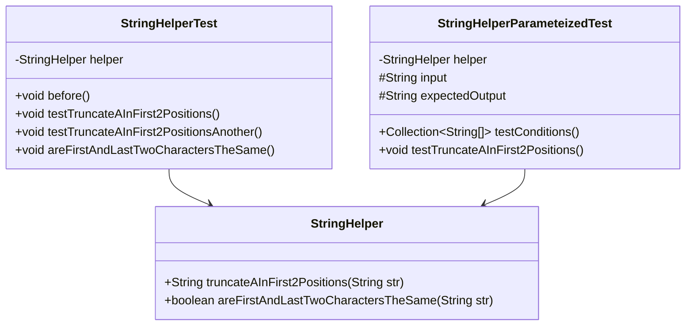
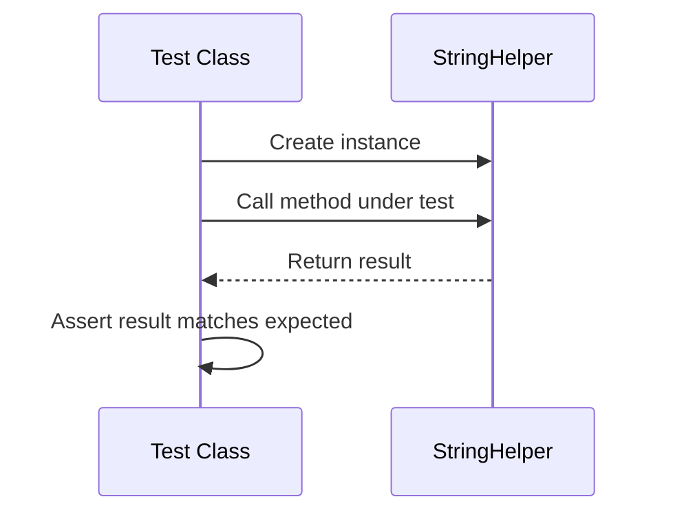

# JUnit Learning Project

A Java project demonstrating JUnit testing practices with a focus on string manipulation utilities.

## Project Structure

```
Learning_Junit/
├── src/
│   ├── main/
│   │   └── java/
│   │       └── com/JunitAnkur/
│   │           └── Main.java
│   └── test/
│       └── java/
│           └── com/JunitAnkur/
│               ├── StringHelperTest.java
│               └── StringHelperParameteizedTest.java
└── pom.xml
```

## Class Diagram



## Features

### StringHelper Utility
- **truncateAInFirst2Positions(String str)**: Removes 'A' characters from the first two positions of a string
  - Example: 
    - Input: "AACD" → Output: "CD"
    - Input: "ACD" → Output: "CD"
    - Input: "CDEF" → Output: "CDEF"

- **areFirstAndLastTwoCharactersTheSame(String str)**: Checks if the first two and last two characters are the same
  - Example:
    - "ABAB" → true
    - "ABCD" → false
    - "AB" → true
    - "A" → false

### Test Coverage

#### StringHelperTest
- Tests basic functionality of string manipulation methods
- Uses JUnit 5 annotations (`@Test`, `@Before`)
- Includes assertions for expected behavior

#### StringHelperParameteizedTest (Planned)
- Will implement parameterized testing for comprehensive input validation
- Uses JUnit 5's `@ParameterizedTest` and `@CsvSource`
- Tests multiple input/output combinations in a single test method

## Dependencies
- Java 19
- JUnit 5.8.1
- JUnit 4.13.1 (for legacy support)

## Getting Started

1. Clone the repository
2. Build the project:
   ```bash
   mvn clean install
   ```
3. Run tests:
   ```bash
   mvn test
   ```

## Test Execution Flow



## Future Enhancements
1. Implement the `StringHelper` class
2. Complete the parameterized tests
3. Add more test cases for edge conditions
4. Add code coverage reporting
5. Set up CI/CD pipeline

## Author
[Your Name]

## License
This project is licensed under the MIT License.
